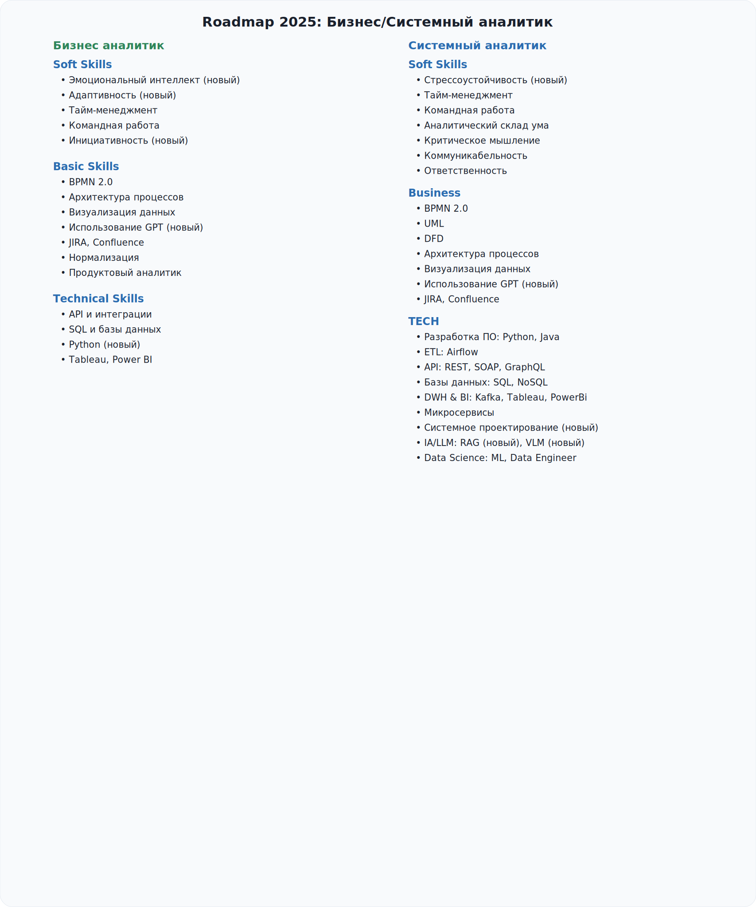

# Roadmap

<figure><figcaption></figcaption></figure>


[business-system-analyst-mind-map.md](business-system-analyst-mind-map.md)



[biznes-sistemnye-analitiki.md](biznes-sistemnye-analitiki.md)


## Навигация по Roadmap



<mark style="color:green;">#Бизнес аналитик</mark> <mark style="color:green;">#Системный аналитик</mark>


[gibkie-navyki-soft-skills](basic\_knowledge/gibkie-navyki-soft-skills/)


<table data-view="cards">
<thead>
<tr><th></th><th></th><th></th><th data-hidden data-card-target data-type="content-ref"></th><th data-hidden data-card-cover data-type="files"></th></tr>
</thead>
<tbody>
<tr><td>Эмоциональный интеллект (Emotional intelligence)</td><td></td><td></td><td><a href="basic_knowledge/gibkie-navyki-soft-skills/emocionalnyi-intellekt-emotional-intelligence.md">emocionalnyi-intellekt-emotional-intelligence.md</a></td><td></td></tr>
<tr><td>Стрессоустойчивость (Stress resilience)</td><td></td><td></td><td><a href="basic_knowledge/gibkie-navyki-soft-skills/stressoustoychivost-stress-resilience.md">stressoustoychivost-stress-resilience.md</a></td><td></td></tr>
<tr><td>Тайм-менеджмент (Time management)</td><td></td><td></td><td><a href="basic_knowledge/gibkie-navyki-soft-skills/time-menedzhment-time-management.md">time-menedzhment-time-management.md</a></td><td></td></tr>
<tr><td>Командная работа (Teamwork)</td><td></td><td></td><td><a href="basic_knowledge/gibkie-navyki-soft-skills/komandnaya-rabota-teamwork.md">komandnaya-rabota-teamwork.md</a></td><td></td></tr>
<tr><td>Инициативность (Initiative)</td><td></td><td></td><td><a href="basic_knowledge/gibkie-navyki-soft-skills/iniciativnost-initiative.md">iniciativnost-initiative.md</a></td><td></td></tr>
<tr><td>Ответственность (Responsibility)</td><td></td><td></td><td><a href="basic_knowledge/gibkie-navyki-soft-skills/otvetstvennost-responsibility.md">otvetstvennost-responsibility.md</a></td><td></td></tr>
<tr><td>Анализ (Analysis)</td><td></td><td></td><td><a href="basic_knowledge/gibkie-navyki-soft-skills/analiz-analysis.md">analiz-analysis.md</a></td><td></td></tr>
<tr><td>Логика (Logic)</td><td></td><td></td><td><a href="basic_knowledge/gibkie-navyki-soft-skills/logicheskoe-myshlenie-logics.md">logicheskoe-myshlenie-logics.md</a></td><td></td></tr>
<tr><td>Креативность (Creativity)</td><td></td><td></td><td><a href="basic_knowledge/gibkie-navyki-soft-skills/kreativnost-creativity.md">kreativnost-creativity.md</a></td><td></td></tr>
<tr><td>Критическое мышление (Critical thinking)</td><td></td><td></td><td><a href="basic_knowledge/gibkie-navyki-soft-skills/kriticheskoe-myshlenie-critical-thinking.md">kriticheskoe-myshlenie-critical-thinking.md</a></td><td></td></tr>
<tr><td>Аналитическое мышление (Analytical thinking)</td><td></td><td></td><td><a href="basic_knowledge/gibkie-navyki-soft-skills/analiticheskoe-myshlenie-analytical-thinking.md">analiticheskoe-myshlenie-analytical-thinking.md</a></td><td></td></tr>
<tr><td>Системное мышление (System thinking)</td><td></td><td></td><td><a href="basic_knowledge/gibkie-navyki-soft-skills/system_thinking.md">system_thinking.md</a></td><td></td></tr>
<tr><td>Быстрая адаптация (Fast adaptation)</td><td></td><td></td><td><a href="basic_knowledge/gibkie-navyki-soft-skills/bystraya-adaptaciya-fast-adaptation.md">bystraya-adaptaciya-fast-adaptation.md</a></td><td></td></tr>
<tr><td>Язык и грамматика (Language and literacy)</td><td></td><td></td><td><a href="basic_knowledge/gibkie-navyki-soft-skills/yazyk-i-grammatika-language-and-literacy.md">yazyk-i-grammatika-language-and-literacy.md</a></td><td></td></tr>
<tr><td>Навыки коммуникации (Communication skills)</td><td></td><td></td><td><a href="basic_knowledge/gibkie-navyki-soft-skills/navyki-kommunikacii-sommunication-skills.md">navyki-kommunikacii-sommunication-skills.md</a></td><td></td></tr>
<tr><td>Память (Memory)</td><td></td><td></td><td><a href="basic_knowledge/gibkie-navyki-soft-skills/pamyat-memory.md">pamyat-memory.md</a></td><td></td></tr>
<tr><td>Демонстрации (Demo)</td><td></td><td></td><td><a href="basic_knowledge/gibkie-navyki-soft-skills/demonstracii-demo.md">demonstracii-demo.md</a></td><td></td></tr>
<tr><td>Интервью (Interview)</td><td></td><td></td><td><a href="basic_knowledge/requirements/metody-sbora-trebovanii.md">metody-sbora-trebovanii.md</a></td><td></td></tr>
</tbody>
</table>



<mark style="color:green;">#Бизнес аналитик</mark> <mark style="color:green;">#Системный аналитик</mark>

<table data-view="cards">
<thead>
<tr><th></th><th></th><th></th><th data-hidden data-card-target data-type="content-ref"></th></tr>
</thead>
<tbody>
<tr><td>Требования (Requirements)</td><td></td><td></td><td><a href="basic_knowledge/requirements/">requirements</a></td></tr>
<tr><td>Проектирование (Engineering/Design)</td><td></td><td></td><td><a href="basic_knowledge/proektirovanie-engineering-design/">proektirovanie-engineering-design</a></td></tr>
<tr><td>Процесс (Process)</td><td></td><td></td><td><a href="basic_knowledge/process-process/">process-process</a></td></tr>
<tr><td>Архитектура процессов</td><td></td><td></td><td><a href="basic_knowledge/arhitektura-processov-process-architecture.md">arhitektura-processov-process-architecture.md</a></td></tr>
<tr><td>Визуализация данных</td><td></td><td></td><td><a href="basic_knowledge/vizualizaciya-dannykh-data-visualization.md">vizualizaciya-dannykh-data-visualization.md</a></td></tr>
<tr><td>Использование GPT</td><td></td><td></td><td><a href="basic_knowledge/ispolzovanie-gpt-dlya-analitika.md">ispolzovanie-gpt-dlya-analitika.md</a></td></tr>
<tr><td>JIRA, Confluence</td><td></td><td></td><td><a href="basic_knowledge/jira-confluence-dlya-analitika.md">jira-confluence-dlya-analitika.md</a></td></tr>
<tr><td>Нормализация данных</td><td></td><td></td><td><a href="basic_knowledge/normalizaciya-dannykh.md">normalizaciya-dannykh.md</a></td></tr>
<tr><td>Нотации (Notations)</td><td></td><td></td><td><a href="basic_knowledge/notacii-notations/">notacii-notations</a></td></tr>
<tr><td>BPMN 2.0</td><td></td><td></td><td><a href="basic_knowledge/notacii-notations/bpmn.md">bpmn.md</a></td></tr>
<tr><td>UML</td><td></td><td></td><td><a href="basic_knowledge/notacii-notations/uml.md">uml.md</a></td></tr>
<tr><td>DFD</td><td></td><td></td><td><a href="basic_knowledge/notacii-notations/dfd.md">dfd.md</a></td></tr>
<tr><td>Документирование (Documentation)</td><td></td><td></td><td><a href="basic_knowledge/dokumentirovanie-documentation/">dokumentirovanie-documentation</a></td></tr>
<tr><td>Управление продуктом</td><td>(Product managment)</td><td></td><td><a href="basic_knowledge/upravlenie-produktom-product-managment.md">upravlenie-produktom-product-managment.md</a></td></tr>
<tr><td>Продуктовый аналитик</td><td></td><td></td><td><a href="basic_knowledge/productovyi-analitik.md">productovyi-analitik.md</a></td></tr>
<tr><td>Жизненный цикл программного продукта (Product Development Life Cycle)</td><td></td><td></td><td><a href="basic_knowledge/zhiznennyi-cikl-programmnogo-produkta-product-development-life-cycle/">zhiznennyi-cikl-programmnogo-produkta-product-development-life-cycle</a></td></tr>
<tr><td>Дизайн (UX/UI)</td><td></td><td></td><td><a href="basic_knowledge/proektirovanie-engineering-design/ux-ui.md">ux-ui.md</a></td></tr>
</tbody>
</table>



&#x20;<mark style="color:green;">#Системный аналитик</mark>

<table data-view="cards">
<thead>
<tr><th></th><th></th><th></th><th data-hidden data-card-target data-type="content-ref"></th></tr>
</thead>
<tbody>
<tr><td>Работа с данными (Work with data)</td><td></td><td></td><td><a href="systems_analyst/rabota-s-dannymi-work-with-data/">rabota-s-dannymi-work-with-data</a></td></tr>
<tr><td>ETL: Airflow</td><td></td><td></td><td><a href="systems_analyst/rabota-s-dannymi-work-with-data/airflow-etl.md">airflow-etl.md</a></td></tr>
<tr><td>DWH &amp; BI</td><td></td><td></td><td><a href="systems_analyst/rabota-s-dannymi-work-with-data/dwh-bi.md">dwh-bi.md</a></td></tr>
<tr><td>Базы данных (SQL &amp; NoSQL)</td><td></td><td></td><td><a href="systems_analyst/rabota-s-dannymi-work-with-data/bazy-dannykh/README.md">bazy-dannykh</a></td></tr>
<tr><td>API и интеграции (API &amp; Integration)</td><td></td><td></td><td><a href="systems_analyst/api-and-integracii-api-and-integration/">api-and-integracii-api-and-integration</a></td></tr>
<tr><td>Интернет (Network)</td><td></td><td></td><td><a href="systems_analyst/kompyuternye-seti-internet/">kompyuternye-seti-internet</a></td></tr>
<tr><td>Разработка (Development)</td><td></td><td></td><td><a href="systems_analyst/razrabotka-development/">razrabotka-development</a></td></tr>
<tr><td>Python</td><td></td><td></td><td><a href="systems_analyst/razrabotka-development/python.md">python.md</a></td></tr>
<tr><td>Java</td><td></td><td></td><td><a href="systems_analyst/razrabotka-development/java.md">java.md</a></td></tr>
<tr><td>Архитектура (Architecture)</td><td></td><td></td><td><a href="systems_analyst/arkhitektura-architecture/">arkhitektura-architecture</a></td></tr>
<tr><td>Микросервисы</td><td></td><td></td><td><a href="systems_analyst/arkhitektura-architecture/microservices.md">microservices.md</a></td></tr>
<tr><td>Системное проектирование</td><td></td><td></td><td><a href="systems_analyst/arkhitektura-architecture/sistemnoe-proektirovanie-system-design.md">sistemnoe-proektirovanie-system-design.md</a></td></tr>
<tr><td>IA/LLM</td><td></td><td></td><td><a href="systems_analyst/ia-llm/">ia-llm</a></td></tr>
<tr><td>RAG</td><td></td><td></td><td><a href="systems_analyst/ia-llm/rag.md">rag.md</a></td></tr>
<tr><td>VLM</td><td></td><td></td><td><a href="systems_analyst/ia-llm/vlm.md">vlm.md</a></td></tr>
<tr><td>Data Science</td><td></td><td></td><td><a href="systems_analyst/data-science/">data-science</a></td></tr>
<tr><td>Машинное обучение (ML)</td><td></td><td></td><td><a href="systems_analyst/data-science/ml.md">ml.md</a></td></tr>
<tr><td>Data Engineer</td><td></td><td></td><td><a href="systems_analyst/data-science/data-engineer.md">data-engineer.md</a></td></tr>
</tbody>
</table>


