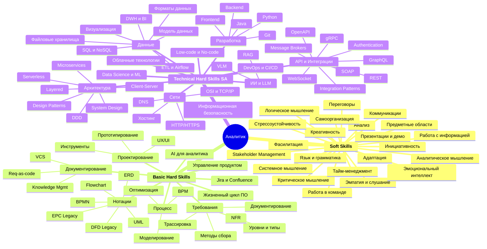
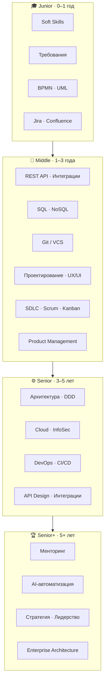

# Roadmap бизнес/системного аналитика

Открытый учебный роадмап для тех, кто хочет стать или вырасти как бизнес- или системный аналитик. Охватывает весь путь от Junior до Senior+ по трём направлениям: Soft Skills, Basic Hard Skills и Technical Hard Skills.

## Как устроен роадмап

Каждая статья содержит:

| Элемент | Описание |
|---------|----------|
| **Грейд** | 🟢 Junior (0–1 год) · 🔵 Middle (1–3 года) · 🟠 Senior (3–5 лет) · 🔴 Senior+ (5+ лет) |
| **Роль** | 🅱️ Business Analyst · 🅰️ System Analyst · 🅱️🅰️ BA + SA |
| **Содержание** | Теория с примерами из работы аналитика, таблицы сравнений, практические кейсы |
| **Ресурсы** | 📚 Ссылки на roadmap.sh, документацию, статьи, курсы, книги, видео |


[biznes-sistemnye-analitiki.md](biznes-sistemnye-analitiki.md)


## Карта навыков

## Прогрессия по грейдам

## 🗺️ Интерактивная карта с кликабельными ссылками

Файл [`roadmap-links.mermaid`](roadmap-links.mermaid) содержит flowchart с кликабельными узлами — клик по каждому техническому блоку открывает соответствующий роадмап на roadmap.sh.

## 🔗 Связанные роадмапы на roadmap.sh

| Тема в роадмапе | Роадмап на roadmap.sh |
|---|---|
| SQL и NoSQL / Данные | [SQL Roadmap](https://roadmap.sh/sql) |
| API и Интеграции (REST, gRPC, GraphQL) | [API Design Roadmap](https://roadmap.sh/api-design) |
| Git / VCS | [Git & GitHub Roadmap](https://roadmap.sh/git-github) |
| UX/UI / Проектирование | [UX Design Roadmap](https://roadmap.sh/ux-design) |
| Backend / Разработка | [Backend Roadmap](https://roadmap.sh/backend) |
| Frontend / Разработка | [Frontend Roadmap](https://roadmap.sh/frontend) |
| Архитектура (DDD, Microservices, Patterns) | [Software Design & Architecture](https://roadmap.sh/software-design-architecture) |
| Архитектура (системный уровень) | [System Design Roadmap](https://roadmap.sh/system-design) |
| DevOps и CI/CD | [DevOps Roadmap](https://roadmap.sh/devops) |
| DevOps / Контейнеры | [Docker Roadmap](https://roadmap.sh/docker) |
| Информационная безопасность | [Cyber Security Roadmap](https://roadmap.sh/cyber-security) |
| Data Analytics и BI | [Data Analyst Roadmap](https://roadmap.sh/data-analyst) |

## Навигация по Roadmap



<mark style="color:green;">#Бизнес аналитик</mark> <mark style="color:green;">#Системный аналитик</mark>


[gibkie-navyki-soft-skills](basic\_knowledge/gibkie-navyki-soft-skills/)


<table data-view="cards"><thead><tr><th></th><th></th><th></th><th data-hidden data-card-target data-type="content-ref"></th><th data-hidden data-card-cover data-type="files"></th></tr></thead><tbody><tr><td>Анализ (Analysis)</td><td></td><td></td><td><a href="basic_knowledge/gibkie-navyki-soft-skills/analiz-analysis.md">analiz-analysis.md</a></td><td></td></tr><tr><td>Логика (Logic)</td><td></td><td></td><td><a href="basic_knowledge/gibkie-navyki-soft-skills/logicheskoe-myshlenie-logics.md">logicheskoe-myshlenie-logics.md</a></td><td></td></tr><tr><td>Креативность (Creativity)</td><td></td><td></td><td><a href="basic_knowledge/gibkie-navyki-soft-skills/kreativnost-creativity.md">kreativnost-creativity.md</a></td><td></td></tr><tr><td>Критическое мышление (Critical thinking)</td><td></td><td></td><td><a href="basic_knowledge/gibkie-navyki-soft-skills/kriticheskoe-myshlenie-critical-thinking.md">kriticheskoe-myshlenie-critical-thinking.md</a></td><td></td></tr><tr><td>Аналитическое мышление (Analytical thinking)</td><td></td><td></td><td><a href="basic_knowledge/gibkie-navyki-soft-skills/analiticheskoe-myshlenie-analytical-thinking.md">analiticheskoe-myshlenie-analytical-thinking.md</a></td><td></td></tr><tr><td>Системное мышление (System thinking)</td><td></td><td></td><td><a href="basic_knowledge/gibkie-navyki-soft-skills/system_thinking.md">system_thinking.md</a></td><td></td></tr><tr><td>Быстрая адаптация (Fast adaptation)</td><td></td><td></td><td><a href="basic_knowledge/gibkie-navyki-soft-skills/bystraya-adaptaciya-fast-adaptation.md">bystraya-adaptaciya-fast-adaptation.md</a></td><td></td></tr><tr><td>Язык и грамматика (Language and literacy)</td><td></td><td></td><td><a href="basic_knowledge/gibkie-navyki-soft-skills/yazyk-i-grammatika-language-and-literacy.md">yazyk-i-grammatika-language-and-literacy.md</a></td><td></td></tr><tr><td>Навыки коммуникации (Communication skills)</td><td></td><td></td><td><a href="basic_knowledge/gibkie-navyki-soft-skills/navyki-kommunikacii-sommunication-skills.md">navyki-kommunikacii-sommunication-skills.md</a></td><td></td></tr><tr><td>Память (Memory)</td><td></td><td></td><td><a href="basic_knowledge/gibkie-navyki-soft-skills/pamyat-memory.md">pamyat-memory.md</a></td><td></td></tr><tr><td>Демонстрации (Demo) </td><td></td><td></td><td><a href="basic_knowledge/gibkie-navyki-soft-skills/demonstracii-demo.md">demonstracii-demo.md</a></td><td></td></tr><tr><td>Интервью (Interview)</td><td></td><td></td><td><a href="basic_knowledge/gibkie-navyki-soft-skills/intervyu-interview.md">intervyu-interview.md</a></td><td></td></tr><tr><td>Эмоциональный интеллект (EQ)</td><td></td><td></td><td><a href="basic_knowledge/gibkie-navyki-soft-skills/emocionalnyi-intellekt-emotional-intelligence.md">emocionalnyi-intellekt-emotional-intelligence.md</a></td><td></td></tr><tr><td>Инициативность (Initiative)</td><td></td><td></td><td><a href="basic_knowledge/gibkie-navyki-soft-skills/iniciativnost-initiative.md">iniciativnost-initiative.md</a></td><td></td></tr><tr><td>Ответственность (Responsibility)</td><td></td><td></td><td><a href="basic_knowledge/gibkie-navyki-soft-skills/otvetstvennost-responsibility.md">otvetstvennost-responsibility.md</a></td><td></td></tr><tr><td>Стрессоустойчивость (Stress Resilience)</td><td></td><td></td><td><a href="basic_knowledge/gibkie-navyki-soft-skills/stressoustoychivost-stress-resilience.md">stressoustoychivost-stress-resilience.md</a></td><td></td></tr></tbody></table>



<mark style="color:green;">#Бизнес аналитик</mark> <mark style="color:green;">#Системный аналитик</mark>

<table data-view="cards"><thead><tr><th></th><th></th><th></th><th data-hidden data-card-target data-type="content-ref"></th></tr></thead><tbody><tr><td>Требования (Requirements)</td><td></td><td></td><td><a href="basic_knowledge/requirements/">requirements</a></td></tr><tr><td>Проектирование (Engineering/Design)</td><td></td><td></td><td><a href="basic_knowledge/proektirovanie-engineering-design/">proektirovanie-engineering-design</a></td></tr><tr><td>Процесс (Process)</td><td></td><td></td><td><a href="basic_knowledge/process-process/">process-process</a></td></tr><tr><td>Нотации (Notations)</td><td></td><td></td><td><a href="basic_knowledge/notacii-notations/">notacii-notations</a></td></tr><tr><td>Документирование (Documentation)</td><td></td><td></td><td><a href="basic_knowledge/dokumentirovanie-documentation/">dokumentirovanie-documentation</a></td></tr><tr><td>Управление продуктом</td><td>(Product managment)</td><td></td><td><a href="basic_knowledge/upravlenie-produktom-product-managment.md">upravlenie-produktom-product-managment.md</a></td></tr><tr><td>Жизненный цикл программного продукта (Product Development Life Cycle)</td><td></td><td></td><td><a href="basic_knowledge/zhiznennyi-cikl-programmnogo-produkta-product-development-life-cycle/">zhiznennyi-cikl-programmnogo-produkta-product-development-life-cycle</a></td></tr><tr><td>AI для аналитика</td><td>(AI for Analysts)</td><td></td><td><a href="basic_knowledge/ai-dlya-analitika.md">ai-dlya-analitika.md</a></td></tr><tr><td>Jira & Confluence</td><td></td><td></td><td><a href="basic_knowledge/jira-confluence-dlya-analitika.md">jira-confluence-dlya-analitika.md</a></td></tr><tr><td>UX/UI дизайн</td><td></td><td></td><td><a href="basic_knowledge/ux-ui/">ux-ui</a></td></tr></tbody></table>



&#x20;<mark style="color:green;">#Системный аналитик</mark>

<table data-view="cards"><thead><tr><th></th><th></th><th></th><th data-hidden data-card-target data-type="content-ref"></th></tr></thead><tbody><tr><td>Работа с данными (Work with data)</td><td></td><td></td><td><a href="systems_analyst/rabota-s-dannymi-work-with-data/">rabota-s-dannymi-work-with-data</a></td></tr><tr><td>Интернет (Network)</td><td></td><td></td><td><a href="systems_analyst/kompyuternye-seti-internet/">kompyuternye-seti-internet</a></td></tr><tr><td>API и интеграции (API & Integration)</td><td></td><td></td><td><a href="systems_analyst/api-and-integracii-api-and-integration/">api-and-integracii-api-and-integration</a></td></tr><tr><td>Разработка (Development)</td><td></td><td></td><td><a href="systems_analyst/razrabotka-development/">razrabotka-development</a></td></tr><tr><td>Архитектура (Architecture)</td><td></td><td></td><td><a href="systems_analyst/arkhitektura-architecture/">arkhitektura-architecture</a></td></tr><tr><td>Облачные технологии (Cloud)</td><td></td><td></td><td><a href="systems_analyst/oblachnye-tekhnologii-cloud.md">oblachnye-tekhnologii-cloud.md</a></td></tr><tr><td>DevOps и CI/CD</td><td></td><td></td><td><a href="systems_analyst/devops-ci-cd.md">devops-ci-cd.md</a></td></tr><tr><td>Информационная безопасность (InfoSec)</td><td></td><td></td><td><a href="systems_analyst/informacionnaya-bezopasnost.md">informacionnaya-bezopasnost.md</a></td></tr><tr><td>Low-code / No-code</td><td></td><td></td><td><a href="systems_analyst/low-code-no-code.md">low-code-no-code.md</a></td></tr><tr><td>Data Science и ML</td><td></td><td></td><td><a href="systems_analyst/data-science/">data-science</a></td></tr><tr><td>ИИ и LLM</td><td></td><td></td><td><a href="systems_analyst/ia-llm/">ia-llm</a></td></tr></tbody></table>


